FibonacciHeap
====================
Building with Travis: 

This repository has a project with the implementation of a FibonacciHeap.

It is written in C++.

The code of the FibonacciHeap is independent of platform.

Is has two possible main files:

* [Codes](#markdown-header)
	* [A main that triggers unit test;](#markdown-header-emphasis)

	* [A Qt project to manage the stack (With Gui).](#markdown-header-strikethrough)
	
The library used to make the Unit Test is the Catch v2.12.3. The code is already in this repository.

The Qt project generates images of the FibonacciHeap, using the lib Graphviz.
Install this lib in your computer for you to be able to create such images.

The code was written containing the Doxygen documentation.

- - -

You have several options to build the project: 
====================

* [Build tools](#markdown-header)
	* [Makefile (using the file named MakefileGeneral);](#markdown-header-emphasis)
	* [CMake.](#markdown-header-emphasis)
	* [Qt Project (With QMake).](#markdown-header-emphasis)

The project has no leaks (Fully tested with Valgrind).

All the unit tests are ok.

- - -

The functionalities available are: 
====================

* [Functionalities](#markdown-header)
	* [Insert;](#markdown-header-emphasis)
	* [Search;](#markdown-header-emphasis)	
	* [Remove the minimum number;](#markdown-header-emphasis)
	* [Decrease a number with some decrement value;](#markdown-header-emphasis)
	
	
- - -	
Heap sample 1: 
====================
A sample of the heap is shown below (type of view 1):

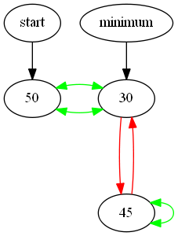	

- - -	
Heap sample 2: 
====================
A sample of the heap is shown below (type of view 2):

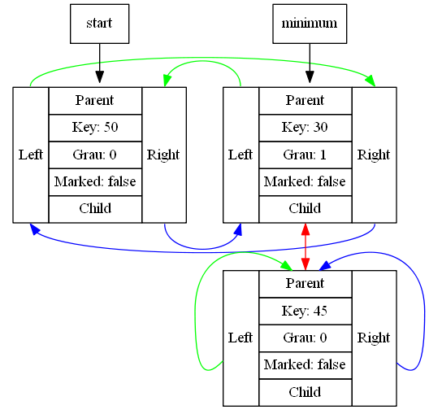	
	
- - -

Insertion demo steps (simple view): 
====================

## Initial

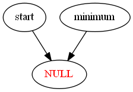

## Inserting 50

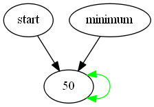

## Inserting 100

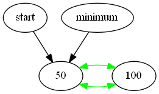

## Inserting 75

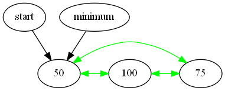

## Inserting 200

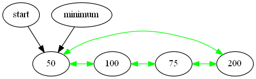

- - -

Insertion demo steps (improved view): 
====================

## Initial

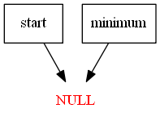

## Inserting 50

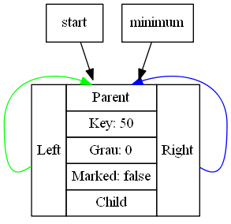

## Inserting 100

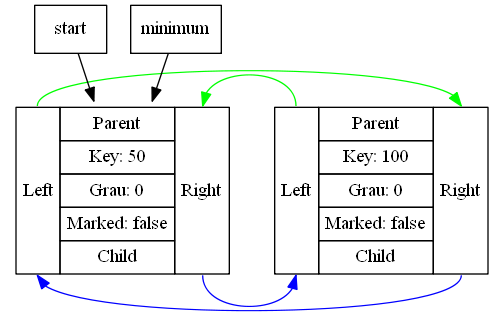

## Inserting 75

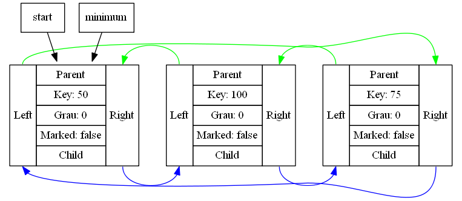

## Inserting 200

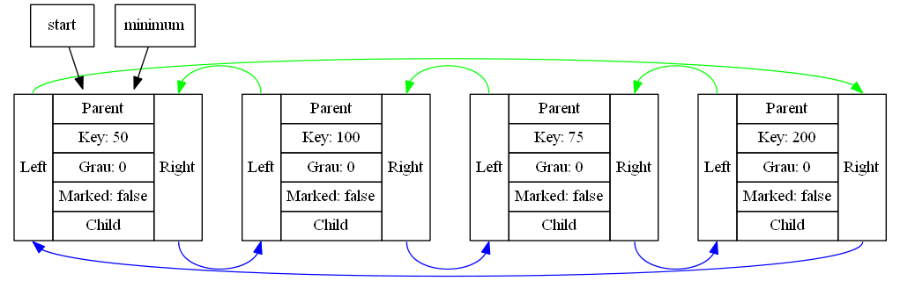

- - -

Remove min steps (simple view): 
====================

## Initial 

## Removing

## Removing

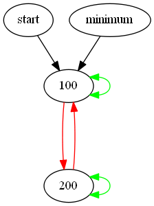

## Removing

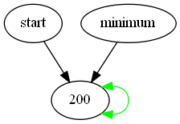

## Removing

- - -

Remove min steps (improved view): 
====================

## Initial 

## Removing

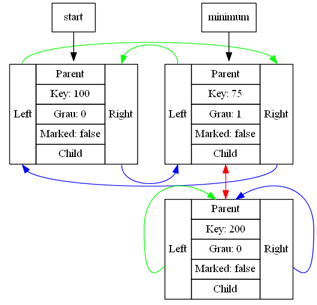

## Removing

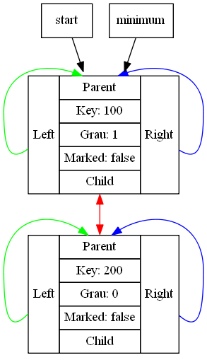

## Removing

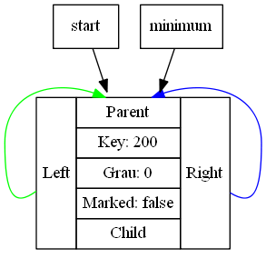

## Removing

- - -

Decrement steps (case 1): 
====================

## Initial 

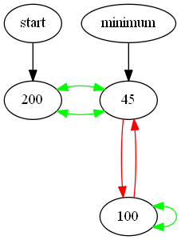

## Decrementing the entry 100 by 2

- - -

Decrement steps (case 2): 
====================

## Initial 

## Decrementing the entry 98 by 97

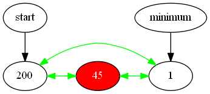

Qt gui project: 
====================
The qt gui application gui is shown below:

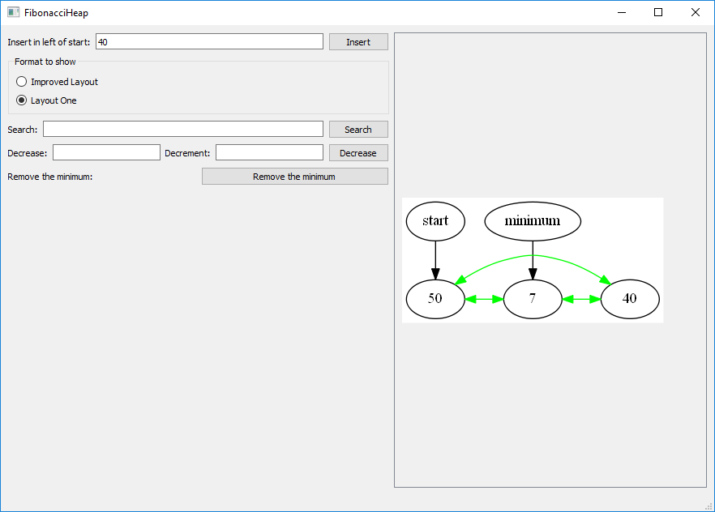
